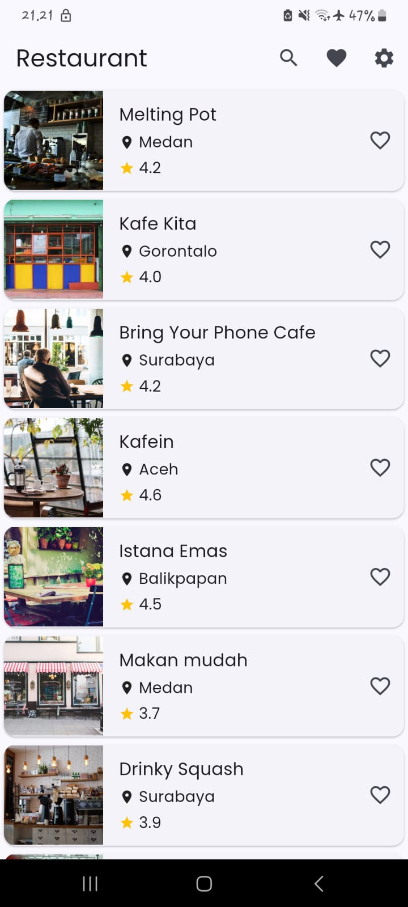
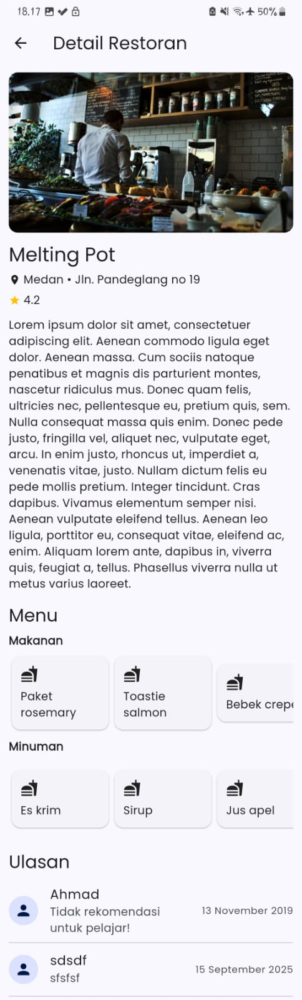
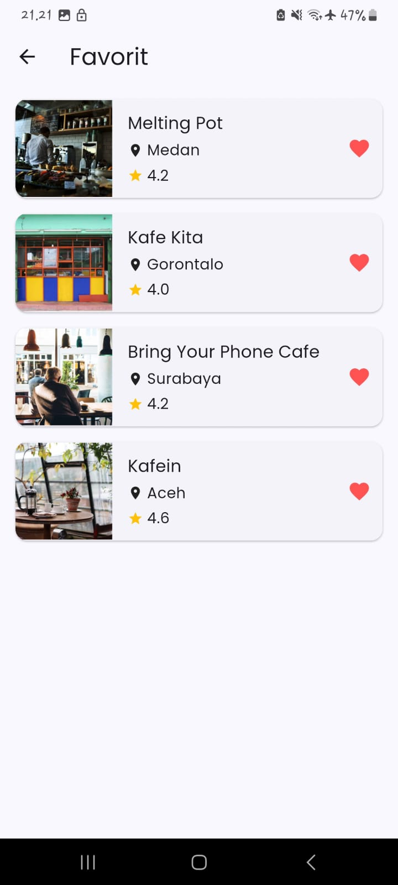
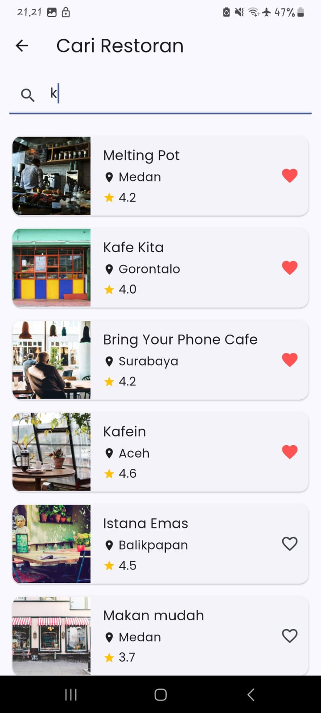

# 🍽️ Restaurant App

A Flutter application that displays restaurant information using the [Dicoding Restaurant API](https://restaurant-api.dicoding.dev).  
The app includes restaurant listing, search, detail pages, favorites management, and user reviews.  

---

## ✨ Features
- 📋 View restaurant list
- 🔍 Search restaurants by name
- 🏷️ View restaurant details (menu, reviews, etc.)
- ❤️ Add & remove restaurants from favorites
- 📝 Submit customer reviews
- ⚙️ Settings with theme switching (light/dark)
- 🔔 Local notifications & background service with WorkManager

---

## 🛠️ Tech Stack
- **Flutter** (Dart, Material 3)
- **Provider** for state management
- **SQLite** for local favorites database
- **WorkManager** for background tasks
- **Flutter Local Notifications** for reminders
- **HTTP** for API requests

---

## 📷 Screenshots
> Replace with your own app screenshots

## 📸 Screenshots

| Home | Detail | Favorites | Settings | Search |
|------|--------|-----------|----------|--------|
|  |  |  |  | 


---

## 🚀 Getting Started

### 1. Clone the repo
```bash
git clone https://github.com/USERNAME/restaurant_app.git
cd restaurant_app
```

---

## 📚 API Reference

- Data source: Dicoding Restaurant API

- GET /list → All restaurants

- GET /detail/{id} → Restaurant detail

- GET /search?q={query} → Search restaurants

- POST /review → Submit a review

---

## 👨‍💻 Author

Developed by Rifki Ahmad

Part of Flutter & Dicoding Learning Journey
